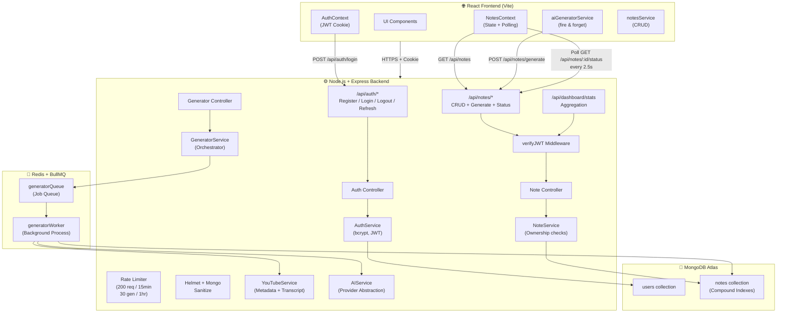

# StudyShell — AI-Powered Notes Generator

> Transform YouTube videos into structured study material: notes, flashcards, mind maps, and flowcharts — all generated by AI in the background while you continue working.

---

## Table of Contents

1. [Project Overview](#1-project-overview)
2. [Architecture Diagram](#2-architecture-diagram)
3. [Tech Stack](#3-tech-stack)
4. [Frontend Architecture](#4-frontend-architecture)
5. [Backend Architecture](#5-backend-architecture)
6. [Authentication Flow](#6-authentication-flow)
7. [YouTube → AI → MongoDB Pipeline](#7-youtube--transcript--ai--mongodb-pipeline)
8. [Redis & BullMQ Architecture](#8-redis--bullmq-architecture)
9. [API Documentation](#9-api-documentation)
10. [Environment Variables](#10-environment-variables)
11. [Local Setup](#11-local-setup)
12. [Production Deployment Considerations](#12-production-deployment-considerations)

---

## 1. Project Overview

StudyShell is a full-stack, production-grade notes application where users paste a YouTube URL and receive fully-structured AI-generated study material:

- **Summarized notes** in rich Markdown
- **Interactive flashcards** for spaced-repetition
- **Draggable mind maps** with SVG canvas
- **Animated flowcharts** for workflow visualization

The AI generation process is **fully asynchronous** — the Express server returns a `202 Accepted` response instantly, while a BullMQ worker processes the heavy transcript extraction and AI generation in the background. The frontend polls for status and automatically updates the UI when the note is ready.

---

## 2. Architecture Diagram



---

## 3. Tech Stack

| Layer | Technology |
|-------|-----------|
| **Frontend** | React 18, Vite, Vanilla CSS |
| **State Management** | React Context API |
| **Backend** | Node.js, Express.js |
| **Database** | MongoDB, Mongoose |
| **Auth** | JWT (access + refresh), bcrypt |
| **Async Queue** | Redis, BullMQ |
| **Security** | Helmet, express-rate-limit, express-mongo-sanitize |
| **AI Abstraction** | Isolated `ai.service.js` (swap any LLM) |

---

## 4. Frontend Architecture

```
Frontend/
└── src/
    ├── services/
    │   ├── api.js                  # Core fetch wrapper (credentials: 'include')
    │   ├── notesService.js         # CRUD, dashboard, status API calls
    │   └── aiGeneratorService.js   # Fire-and-forget generation + polling
    ├── context/
    │   ├── AuthContext.jsx         # User session, login, logout, register
    │   ├── NotesContext.jsx        # Global notes state + background polling
    │   └── ThemeContext.jsx        # Dark/light mode toggle
    ├── components/
    │   ├── Auth.jsx                # Login / Register screen (glassmorphic)
    │   ├── Navbar.jsx              # Navigation + user name + logout button
    │   ├── Dashboard.jsx           # Stats cards + generation history
    │   ├── UrlGenerator.jsx        # URL input + AI trigger
    │   ├── NotesGrid.jsx           # Paginated note grid with filters
    │   ├── MindmapViewer.jsx       # Interactive SVG mind map (pan/zoom)
    │   ├── FlowchartViewer.jsx     # Animated flowchart visualization
    │   └── NoteEditorModal.jsx     # Full note editor / checklist
    └── App.jsx                     # Root: AuthProvider > NotesProvider > AppContent
```

### Key Data Flow

1. `App.jsx` wraps children in `AuthProvider` → `NotesProvider`.
2. On mount, `AuthContext` calls `GET /api/auth/me`. If cookie is valid → user is set. If not → `<Auth />` component is shown (protected gate).
3. Once authenticated, `NotesContext` loads notes from the backend and starts background polling for any `pending`/`processing` notes.
4. The `useEffect` polling hook in `NotesContext` is status-driven — it automatically starts and stops the `setInterval` based on whether any notes are in a processing state.

---

## 5. Backend Architecture

```
Backend/src/
├── config/
│   ├── db.js           # Mongoose connection
│   └── redis.js        # IORedis connection (required by BullMQ)
├── controllers/
│   ├── auth.controller.js
│   ├── note.controller.js
│   ├── generator.controller.js
│   └── dashboard.controller.js
├── services/
│   ├── auth.service.js         # bcrypt hashing, JWT generation
│   ├── note.service.js         # Ownership-safe CRUD + pagination
│   ├── generator.service.js    # Pipeline orchestrator
│   ├── youtube.service.js      # Metadata + transcript extraction
│   ├── ai.service.js           # LLM provider abstraction layer
│   └── dashboard.service.js    # MongoDB $facet aggregation
├── models/
│   ├── user.model.js   # bcrypt methods, JWT methods
│   └── note.model.js   # Status, compound indexes
├── middlewares/
│   └── auth.middleware.js   # verifyJWT (cookie + Bearer)
├── queue/
│   ├── generator.queue.js  # BullMQ Queue definition
│   └── generator.worker.js # BullMQ Worker with failed-job handler
├── routes/
│   ├── auth.routes.js
│   ├── note.routes.js
│   └── dashboard.routes.js
└── utils/
    ├── ApiError.js      # Standardized error class
    ├── ApiResponse.js   # Standardized response class
    └── asyncHandler.js  # try/catch wrapper for async controllers
```

**Design principle:** Controllers are thin — they only parse the request and call a Service. All business logic lives in Services.

---

## 6. Authentication Flow

```
Register:  POST /api/auth/register  → hash password with bcrypt → save User
Login:     POST /api/auth/login     → verify bcrypt → issue accessToken + refreshToken
                                    → Set-Cookie: accessToken (httpOnly, sameSite: strict)
                                    → Set-Cookie: refreshToken (httpOnly, sameSite: strict)

Protected: Every request →  verifyJWT middleware reads cookie or Authorization header
                         →  jwt.verify(token, ACCESS_TOKEN_SECRET)
                         →  User.findById(decoded._id).select('-password')
                         →  Attaches req.user → passes to controller

Refresh:   POST /api/auth/refresh   → reads refreshToken cookie → issues new pair
Logout:    POST /api/auth/logout    → clears both cookies via res.clearCookie()
```

**Key security properties:**
- Refresh token is stored in an `httpOnly`, `sameSite: strict` cookie — inaccessible to JavaScript
- Passwords are never returned in API responses (`.select('-password')` enforced)
- Access tokens expire independently; refresh tokens allow seamless re-authentication

---

## 7. YouTube → Transcript → AI → MongoDB Pipeline

```
POST /api/notes/generate  (Express, responds in <100ms)
    │
    ▼
GeneratorService.createPendingNoteAndEnqueue()
    │  ├─ Extract videoId from URL
    │  ├─ Create Note { status: 'pending' } in MongoDB
    │  └─ addGenerationJob(noteId, url, userId) → Redis Queue
    │
    ▼ 202 Accepted returned to frontend immediately

─────────── Background Worker (BullMQ) ───────────
    │
    ▼
GeneratorService.executeGenerationJob(noteId, url, userId)
    │
    ├─ Note.findByIdAndUpdate → status: 'processing'
    │
    ├─ YouTubeService.getVideoInfo()      → title, thumbnail, duration
    ├─ YouTubeService.getTranscript()     → raw timestamped transcript
    │
    ├─ cleanTranscript()                  → strip timestamps, filler words
    ├─ chunkTranscript()                  → split into AI-safe context windows
    ├─ processChunks()                    → combine chunk summaries
    │
    ├─ Promise.all([                      → run ALL 4 AI calls concurrently
    │     aiService.generateSummary()
    │     aiService.generateNotes()
    │     aiService.generateFlashcards()
    │     aiService.generateMindMap()
    │   ])
    │
    └─ Note.findByIdAndUpdate → status: 'completed' + all generated fields
         OR on error → status: 'failed', error: err.message
```

**AIService is provider-agnostic.** To switch from OpenAI to Gemini or Claude, only `ai.service.js` needs editing.

---

## 8. Redis & BullMQ Architecture

```
                    ┌─────────────────┐
Express Request ──▶ │ generator.queue │ ──▶ Redis (Sorted Set)
                    └─────────────────┘
                           │
                           │ Job payload: { noteId, url, userId }
                           ▼
                    ┌─────────────────┐
                    │generator.worker │  (started in server.js)
                    └─────────────────┘
                           │
           ┌───────────────┼──────────────┐
           │               │              │
      attempt 1       attempt 2      attempt 3
      (fails)     (5s backoff)  (25s backoff)
                                      │
                              failed event handler
                              → Note.status = 'failed'
```

**Job configuration:**
- `attempts: 3` — automatic retries
- `backoff: { type: 'exponential', delay: 5000 }` — 5s, 25s, 125s
- `removeOnComplete: true` — clean up successful jobs from Redis
- `removeOnFail: false` — retain failed jobs for inspection/debugging

---

## 9. API Documentation

### Auth Routes (`/api/auth`)

| Method | Endpoint | Auth | Description |
|--------|----------|------|-------------|
| `POST` | `/register` | ❌ | Create new user account |
| `POST` | `/login` | ❌ | Login and receive session cookies |
| `POST` | `/logout` | ✅ | Clear session cookies |
| `POST` | `/refresh` | ❌ | Refresh access token from cookie |
| `GET` | `/me` | ✅ | Get currently authenticated user |

### Notes Routes (`/api/notes`)

| Method | Endpoint | Auth | Description |
|--------|----------|------|-------------|
| `POST` | `/generate` | ✅ | Enqueue YouTube URL for AI generation |
| `GET` | `/` | ✅ | Get all user notes (paginated) |
| `GET` | `/:id` | ✅ | Get a single note (ownership enforced) |
| `PUT` | `/:id` | ✅ | Update a note (ownership enforced) |
| `DELETE` | `/:id` | ✅ | Soft-delete (or `?permanent=true` for hard delete) |
| `GET` | `/:id/status` | ✅ | Poll processing status (`pending/processing/completed/failed`) |

### Dashboard Routes (`/api/dashboard`)

| Method | Endpoint | Auth | Description |
|--------|----------|------|-------------|
| `GET` | `/stats` | ✅ | Aggregated user productivity statistics |

### Standard Response Shape

All responses follow this envelope:
```json
{
  "success": true,
  "statusCode": 200,
  "message": "Human-readable message",
  "data": { }
}
```

---

## 10. Environment Variables

### Backend (`Backend/.env`)

```env
# Server
PORT=5000
NODE_ENV=development

# Database
MONGODB_URI=mongodb+srv://<user>:<password>@cluster.mongodb.net/studyshell

# Auth Secrets — generate with: node -e "console.log(require('crypto').randomBytes(64).toString('hex'))"
ACCESS_TOKEN_SECRET=your_64_char_random_secret_here
ACCESS_TOKEN_EXPIRY=15m
REFRESH_TOKEN_SECRET=your_different_64_char_secret_here
REFRESH_TOKEN_EXPIRY=7d

# Redis
REDIS_HOST=127.0.0.1
REDIS_PORT=6379

# CORS — must match your frontend origin exactly
CORS_ORIGIN=http://localhost:5173

# AI Provider (add whichever you use)
OPENAI_API_KEY=sk-...
# GEMINI_API_KEY=...
# ANTHROPIC_API_KEY=...
```

### Frontend (`Frontend/.env`)

```env
VITE_API_BASE_URL=http://localhost:5000/api
```

> **⚠️ Security:** Never commit `.env` files. Both are already in `.gitignore`. Never expose `ACCESS_TOKEN_SECRET`, AI keys, or database URIs to the React client.

---

## 11. Local Setup

### Prerequisites

| Tool | Minimum Version |
|------|----------------|
| Node.js | v18+ |
| npm | v9+ |
| MongoDB | Local or Atlas cluster |
| Redis | v7+ (local) |

---

### MongoDB Setup

**Option A — Local:**
```bash
# macOS (Homebrew)
brew tap mongodb/brew
brew install mongodb-community
brew services start mongodb-community

# Windows: Install MongoDB Community Server from mongodb.com/try/download/community
# Then start: net start MongoDB
```

**Option B — Atlas (Cloud, recommended for production):**
1. Go to [cloud.mongodb.com](https://cloud.mongodb.com)
2. Create a free M0 cluster
3. Create a database user and whitelist your IP
4. Copy the connection string into `MONGODB_URI`

---

### Redis Setup

**Local:**
```bash
# macOS (Homebrew)
brew install redis
brew services start redis

# Ubuntu / Debian
sudo apt-get install redis-server
sudo systemctl start redis

# Windows (via WSL2 or Docker)
docker run -d -p 6379:6379 redis:7-alpine
```

Verify: `redis-cli ping` → should return `PONG`

---

### Running the Backend

```bash
cd "NOTES APP/Backend"
npm install
cp .env.example .env      # fill in your values
npm run dev               # starts server on port 5000
```

The BullMQ worker starts automatically when `server.js` runs — no separate process needed in development.

---

### Running the Frontend

```bash
cd "NOTES APP/Frontend"
npm install
cp .env.example .env      # set VITE_API_BASE_URL
npm run dev               # starts Vite on port 5173
```

Open [http://localhost:5173](http://localhost:5173)

---

### Running the Worker (Separate Process for Production)

In development, the worker runs inside `server.js`. For production, extract it to a dedicated process:

```bash
# Create Backend/worker.js:
require('dotenv').config();
require('./src/config/db')(); // connect MongoDB
require('./src/queue/generator.worker'); // start BullMQ worker
console.log('Worker started');
```

Then run independently:
```bash
node worker.js
```

---

## 12. Production Deployment Considerations

### Security Hardening
- [ ] Set `NODE_ENV=production` — enables secure cookies and hides stack traces
- [ ] Use strong, unique 64-char secrets for `ACCESS_TOKEN_SECRET` and `REFRESH_TOKEN_SECRET`
- [ ] Set `CORS_ORIGIN` to your exact production frontend domain only
- [ ] Add `sameSite: 'strict'` + `secure: true` to cookies (already done when `NODE_ENV=production`)
- [ ] Rotate all secrets immediately if they are ever exposed

### Scalability
- [ ] Deploy the BullMQ worker as a **separate service/process** from the Express API server — so AI processing never impacts API response times
- [ ] Use **MongoDB Atlas** with connection pooling for the production database
- [ ] Use **Redis Cloud** or **ElastiCache** for production Redis
- [ ] Enable **horizontal scaling** of Express API — BullMQ jobs are processed from Redis, so multiple API instances share the same queue safely

### Infrastructure
- [ ] Use a process manager like **PM2** for zero-downtime restarts: `pm2 start server.js`
- [ ] Put the Express server behind **Nginx** or a cloud load balancer
- [ ] Enable **HTTPS/TLS** — required for `secure: true` cookies to work
- [ ] Set up **MongoDB Atlas backups** on a scheduled policy
- [ ] Add **health check endpoint** (`GET /healthz`) for load balancer probes

### Monitoring
- [ ] Use **BullMQ Board** or **Bull-Board** to visualize your queue in a web UI
- [ ] Set up error alerting (Sentry, Datadog) — particularly on BullMQ `failed` events
- [ ] Add **structured logging** (e.g., Winston + CloudWatch) — never log passwords, tokens, or PII

### Frontend
- [ ] Build with `npm run build` and serve the `/dist` folder via Nginx or a CDN
- [ ] Set `VITE_API_BASE_URL` to your production API domain (e.g., `https://api.studyshell.com/api`)
- [ ] Configure **cache headers** for the Vite build output (fingerprinted filenames make long-term caching safe)
